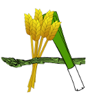

# **LaCena**

## Introducción
**Alacena** pretende solventar esa gran duda que envuelve a todos los hogares. ***Que hacemos para comer?***  Alacena es una aplicación web que ofrece multiples recetas en función de los **ingredientes** que tengas en casa. El ususario solo tiene que acceder al sitio web de **Alacena** , introducir los ingredientes que tienen en casa y te aparecerán una variedad de recetas que podras preparar. 
Los usuarios también podrán registrarse en el sitio web y tener un registro de todos los ingredientes que tiene en casa, añadiedo o eliminando. De esta forma la aplicación podra hacer una busqueda más exaustiva y listar las recetas de la que dispongas todos los ingredientes. 

## Funcionalidad
El usuario introducirá los filtros y los ingredientes que serán enviados a la aplicación mediante un metodo POST. Esta irá solicitando recetas a la API para cada uno de los ingredientes junto con los filtros, guardará los datos necesarios en un dict y los ordenará en función del número de ingredientes que coincidan con los que ha introducido el usuario y en caso de estar registrado, los que tiene guardado en la "despensa". Por último los mostrará los resultados con los enlaces a la página original de la receta y a un video de la receta en youtube.

## APIs
* [Edamam API](https://developer.edamam.com/es/api-recetas-edamam-documentacion) Devuelve un listado de recetas en función de un ingrediente y varios filtros como: Calorias, etiqueta de salud, dieta... Los datos vienen en formato *JSON* y tiene una autentificación de usuario y contraseñá en los parametros.
* [Youtube API](https://developers.google.com/youtube/v3/docs/search/list) Busca un video de cada receta.

## Funciones
* **SolicitarRecetas**: Hace una petición request a la API de *Edamam* y guarda la respuesta en una lista de diccionarios.
* **Coincidencias**: Añade una variable con el numero de coincidencias de ingredientes de la receta con los del usuario.
* **ImprimirConsola**: Muestra las recetas que ha respondido la API de forma clara por consola.
* **DarIngredientes**: Devuelve los ingredientes que tiene el usuario guardados en su fichero JSON.
* **AnadirIng**: Añade un nuevo ingrediente introducido por el usuario en el fichero JSON.
* **PedirVideo**: Hace una petición request a la API de youtube y devuelve la url del video.

## Rutas
* **/:** Pagina de inicio. Una pagina estática con un menú y varios enlaces que redirigiran al usuario a las distintas paginas de la web:
	* Buscador
	* Despensa
	* Inicio / Registro
	* Acerca de (otra página estática que describe la funcionalidad de la web)
	* Repositorio de Github
* **/buscar** Buscador de recetas. Aqui el usuario rellena el formulario que se enviará a la aplicación mediante un metodo POST y contendra: un filtro de busqueda para la API y Los ingredientes con los que se buscará el resultado más especifico. Si el usuario está registrado, aprte de los ingredientes que introduzca en el formulario se añadirán los que tenga guardados.
* **/resultados/num** Listado de recetas encontradas y ordenadas de mayor numero de ingredientes introducidos a menor. Se muestran de 10 en 10 y al pasar a la siguiente página se solicitan las siguientes 10 a la aplicación.
* **/despensa** Listado de ingredientes guardados por un determinado usuario.	
* **/salir** Ruta para desloguearse el usuario.
* **/eliminar/cod** Ruta para eliminar un determinado ingrediente de la "despensa" del usuario.
* **/acerdade** Ruta que redirige a una pagina estática de información.

## Hoja de estilo
La hoja de estilo *css* la he descargado de un proveedor gratuito de las mismas. [Templated](https://templated.co/) por lo que mi pagina será una pagina web válida.
